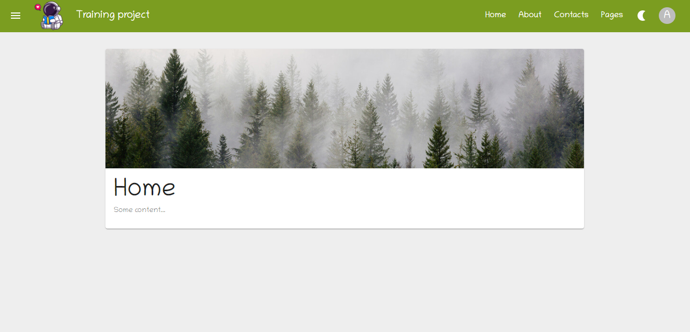

# Training project



## Project setup
```
npm install
```

### Compiles and hot-reloads for development
```
npm run dev-server
```
### Run your json-server
```
npm run api-server
```
### Compiles and minifies for production
```
npm run build
```
### Run frontend part and json-server
```
npm run start
```
